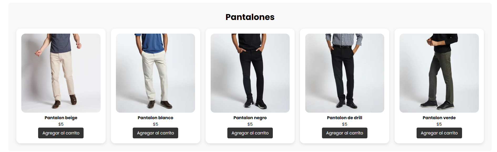
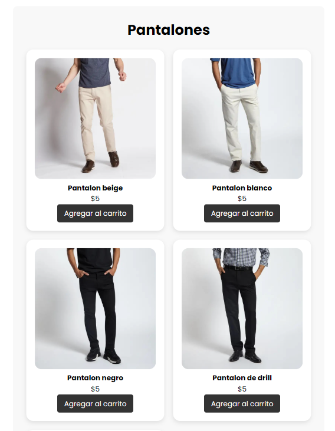
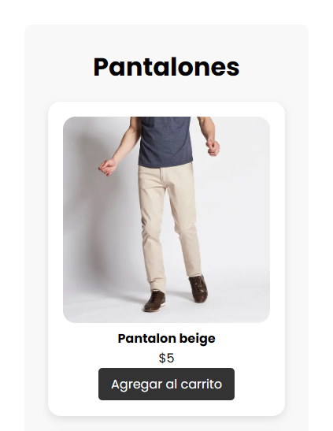

# Informe Técnico: Implementación de Diseño Responsive

## Introducción
El diseño responsive es una técnica fundamental en el desarrollo web moderno, permitiendo que las interfaces se adapten a diferentes dispositivos y tamaños de pantalla. En este informe se detalla la implementación de un diseño responsive utilizando **CSS Grid, Flexbox y Media Queries**, así como las pruebas realizadas para garantizar su correcta adaptación.

## Implementación del Diseño Responsive

### Uso de CSS Grid
CSS Grid se utilizó para estructurar el diseño en una cuadrícula flexible, lo que facilita la disposición de los elementos en diferentes tamaños de pantalla. 

#### Contenedor de los productos
```css
.grid-container {
    display: grid;
    grid-template-columns: repeat(auto-fit, minmax(300px, 1fr));
    justify-content: center;
    gap: 20px;
}
```

**Explicación:**
- `grid-template-columns: repeat(auto-fit, minmax(300px, 1fr))` permite que los elementos se ajusten automáticamente según el espacio disponible.
- `gap: 20px` define el espaciado entre los elementos de la cuadrícula.

### Uso de Flexbox
Flexbox se empleó para la alineación y distribución de los elementos dentro de los contenedores, asegurando un diseño fluido.

#### Barra de navegación
```css
.navbar {
    display: flex;
    justify-content: space-between;
    align-items: center;
}
.nav-links{
    display: flex;
    gap: 1rem;
}
```
**Explicación:**
- `flex` Convierte el contenedor .navbar y la lista desordenada .nav-links en contenedores flexibles, lo que facilita la distribución de sus elementos internos.
- `justify-content: space-between` distribuye los elementos equitativamente en el contenedor.
- `align-items: center` alinea los elementos verticalmente.

#### Hero Section
```css
.hero {
    display: flex;
    justify-content: center;
    align-items: center;
}
```
**Explicación:**
- `flex` Convierte el contenedor .hero en un contenedor flexible, permitiendo que sus elementos internos se organicen de manera dinámica.
- `justify-content: center` Centra horizontalmente el contenido.
- `align-items: center` Centra verticalmente el contenido.

#### Carrito de compras 
```css
.count-products {
    display: flex;
    justify-content: center;
    align-items: center;
}
.cart-product {
    display: flex;
    align-items: center;
    justify-content: center;
    color: #fff;
    padding: 0.5rem 0; 
    border-bottom: 1px solid rgba(255, 255, 255, 0.3); 
}

.cart-total-price {
    display: flex;
    justify-content: space-between;
    align-items: center;
}
```
**Explicación:**
- Se usó flexbox para centrar el contador de productos, los productos dentro del carrito de compras y el valor total de todos los productos tanto horizontal como verticalmente.

### Uso de Media Queries
Las Media Queries fueron fundamentales para definir estilos específicos según el tamaño de pantalla.

#### Estilos para pantalla menores a 725px
```css
@media (max-width: 725px){
    .hero-content h1 {
        font-size: 1.8rem;
        transition: .3s;
    }
    
    .hero-content p {
        font-size: 1rem;
        transition: .3s;
    }
}    
```
**Explicación:**
- Este bloque ajusta los tamaños de fuente de los elementos dentro de .hero-content para mejorar la legibilidad en pantallas más pequeñas.
- Se reduce el tamaño del encabezado a 1.8rem y el párrafo a 1rem.
- Se aplica una transición de 0.3s para que el cambio sea más suave cuando se ajusta el tamaño de la pantalla.

#### Estilos para pantalla menores a 670px
```css
@media (max-width: 670px){
    .navbar {
        display: flex;
        flex-direction: column;
        align-items: center;
        gap: 0.85rem;
        transition: all .3s;
    }

    .cart-content {
        max-width: 320px;
        left: 50%;
        transform: translateX(-50%);
        top: 50px;
        border-radius: 10px;
    }
}
```
**Explicación:**
- Este bloque mejora la navegación y la visualización del carrito de compras en dispositivos más pequeños.
- `.navbar` se reorganiza en una columna, alineando los elementos al centro y agregando un espacio entre ellos ` (gap: 0.85rem)`.
- `.cart-content` se ajusta con un ancho máximo de 320px, se centra horizontalmente `(left: 50%, transform: translateX(-50%))` y se redondean sus bordes `(border-radius: 10px)`.

#### Estilos para pantalla menores a 480px
```css
@media (max-width: 480px){
    #menu-icon{
        display: block;
        cursor: pointer;
    }

    .nav-links{
        position: absolute;
        top: -600px;
        left: 0;
        right: 0;
        flex-direction: column;
        text-align: center;
        background-color: #555;
        transition: all .42s;
    }

    .nav-links.open{
        top: 100%;
    }
}
```
- Este bloque optimiza la navegación para dispositivos móviles
- Se activa el ícono de menú `#menu-icon`, permitiendo una navegación más accesible en pantallas táctiles.
-  `.nav-links ` se oculta inicialmente  `(top: -600px) ` y se configura como un menú desplegable.
- `.nav-links.open` cambia su posición a `top: 100%`, mostrando el menú cuando el usuario lo activa.
- `flex-direction: column;` y `text-align: center;` ajustan la estructura del menú en dispositivos pequeños para mostrar los elementos en columna.

## Pruebas de Adaptabilidad
Para garantizar la correcta implementación del diseño responsive, se realizaron diversas pruebas para verificar la apariencia en diferentes dispositivos, como **escritorio, tablet y móvil**. Para ello se usó la herramienta de **modo responsive de Chrome DevTools** la cual permitió ajustar el tamaño del navegador manualmente para evaluar la adaptabilidad de los elementos.

### 1. **Apariencia en dispositivos de escritorio**



### 2. **Apariencia en tablets**



### 2. **Apariencia en dispositivos móviles**


## Conclusión
El diseño responsive se implementó con éxito utilizando **CSS Grid, Flexbox y Media Queries**. Las pruebas realizadas confirmaron su correcta adaptabilidad en diferentes dispositivos y resoluciones de pantalla, garantizando una experiencia de usuario óptima.