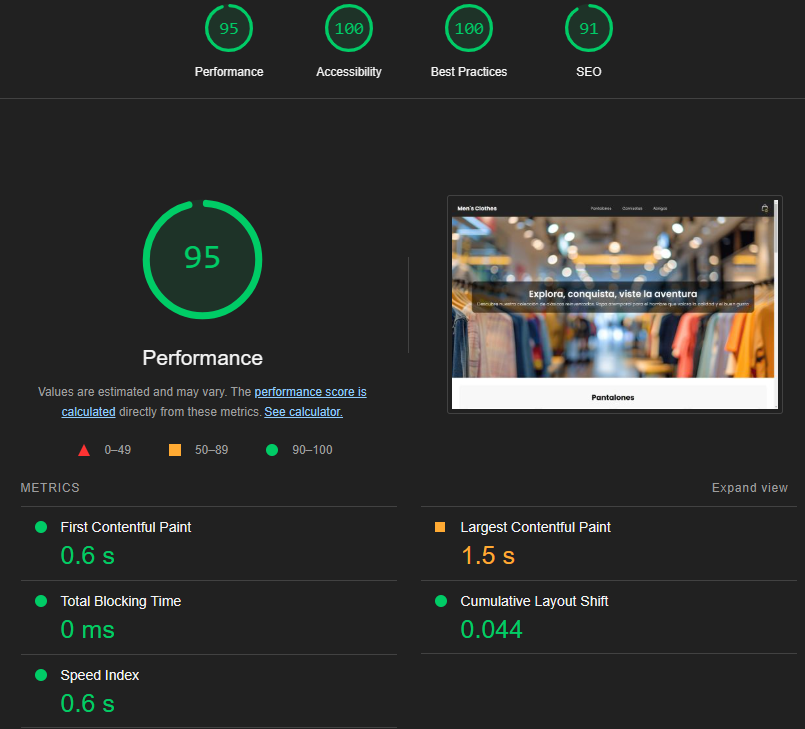
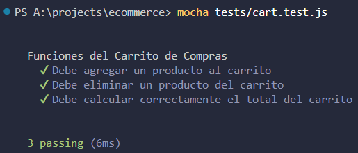
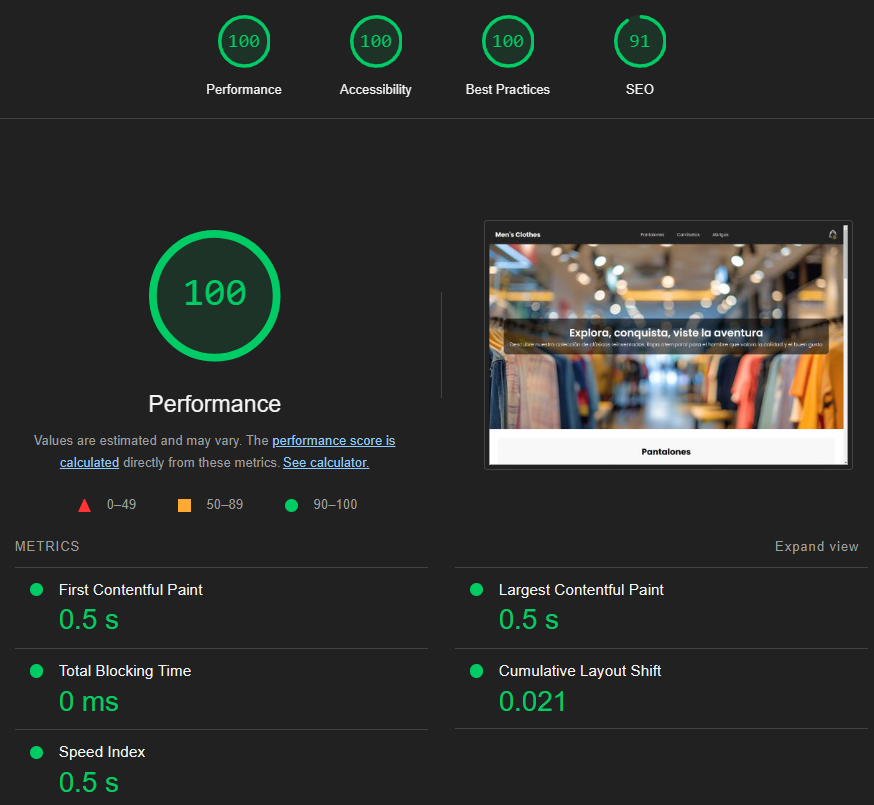

# Informe Técnico: Implementación de Diseño Responsive

## Introducción
El diseño responsive es una técnica fundamental en el desarrollo web moderno, permitiendo que las interfaces se adapten a diferentes dispositivos y tamaños de pantalla. En este informe se detalla la implementación de un diseño responsive utilizando **CSS Grid, Flexbox y Media Queries**, así como las pruebas realizadas para garantizar su correcta adaptación.

## Implementación del Diseño Responsive

### Uso de CSS Grid
CSS Grid se utilizó para estructurar el diseño en una cuadrícula flexible, lo que facilita la disposición de los elementos en diferentes tamaños de pantalla. 

#### Contenedor de los productos
```css
.grid-container {
    display: grid;
    grid-template-columns: repeat(auto-fit, minmax(300px, 1fr));
    justify-content: center;
    gap: 20px;
}
```

**Explicación:**
- `grid-template-columns: repeat(auto-fit, minmax(300px, 1fr))` permite que los elementos se ajusten automáticamente según el espacio disponible.
- `gap: 20px` define el espaciado entre los elementos de la cuadrícula.

### Uso de Flexbox
Flexbox se empleó para la alineación y distribución de los elementos dentro de los contenedores, asegurando un diseño fluido.

#### Barra de navegación
```css
.navbar {
    display: flex;
    justify-content: space-between;
    align-items: center;
}
.nav-links{
    display: flex;
    gap: 1rem;
}
```
**Explicación:**
- `flex` Convierte el contenedor .navbar y la lista desordenada .nav-links en contenedores flexibles, lo que facilita la distribución de sus elementos internos.
- `justify-content: space-between` distribuye los elementos equitativamente en el contenedor.
- `align-items: center` alinea los elementos verticalmente.

#### Hero Section
```css
.hero {
    display: flex;
    justify-content: center;
    align-items: center;
}
```
**Explicación:**
- `flex` Convierte el contenedor .hero en un contenedor flexible, permitiendo que sus elementos internos se organicen de manera dinámica.
- `justify-content: center` Centra horizontalmente el contenido.
- `align-items: center` Centra verticalmente el contenido.

#### Carrito de compras 
```css
.count-products {
    display: flex;
    justify-content: center;
    align-items: center;
}
.cart-product {
    display: flex;
    align-items: center;
    justify-content: center;
    color: #fff;
    padding: 0.5rem 0; 
    border-bottom: 1px solid rgba(255, 255, 255, 0.3); 
}

.cart-total-price {
    display: flex;
    justify-content: space-between;
    align-items: center;
}
```
**Explicación:**
- Se usó flexbox para centrar el contador de productos, los productos dentro del carrito de compras y el valor total de todos los productos tanto horizontal como verticalmente.

### Uso de Media Queries
Las Media Queries fueron fundamentales para definir estilos específicos según el tamaño de pantalla.

#### Estilos para pantalla menores a 725px
```css
@media (max-width: 725px){
    .hero-content h1 {
        font-size: 1.8rem;
        transition: .3s;
    }
    
    .hero-content p {
        font-size: 1rem;
        transition: .3s;
    }
}    
```
**Explicación:**
- Este bloque ajusta los tamaños de fuente de los elementos dentro de .hero-content para mejorar la legibilidad en pantallas más pequeñas.
- Se reduce el tamaño del encabezado a 1.8rem y el párrafo a 1rem.
- Se aplica una transición de 0.3s para que el cambio sea más suave cuando se ajusta el tamaño de la pantalla.

#### Estilos para pantalla menores a 670px
```css
@media (max-width: 670px){
    .navbar {
        display: flex;
        flex-direction: column;
        align-items: center;
        gap: 0.85rem;
        transition: all .3s;
    }

    .cart-content {
        max-width: 320px;
        left: 50%;
        transform: translateX(-50%);
        top: 50px;
        border-radius: 10px;
    }
}
```
**Explicación:**
- Este bloque mejora la navegación y la visualización del carrito de compras en dispositivos más pequeños.
- `.navbar` se reorganiza en una columna, alineando los elementos al centro y agregando un espacio entre ellos ` (gap: 0.85rem)`.
- `.cart-content` se ajusta con un ancho máximo de 320px, se centra horizontalmente `(left: 50%, transform: translateX(-50%))` y se redondean sus bordes `(border-radius: 10px)`.

#### Estilos para pantalla menores a 480px
```css
@media (max-width: 480px){
    #menu-icon{
        display: block;
        cursor: pointer;
    }

    .nav-links{
        position: absolute;
        top: -600px;
        left: 0;
        right: 0;
        flex-direction: column;
        text-align: center;
        background-color: #555;
        transition: all .42s;
    }

    .nav-links.open{
        top: 100%;
    }
}
```
- Este bloque optimiza la navegación para dispositivos móviles
- Se activa el ícono de menú `#menu-icon`, permitiendo una navegación más accesible en pantallas táctiles.
-  `.nav-links ` se oculta inicialmente  `(top: -600px) ` y se configura como un menú desplegable.
- `.nav-links.open` cambia su posición a `top: 100%`, mostrando el menú cuando el usuario lo activa.
- `flex-direction: column;` y `text-align: center;` ajustan la estructura del menú en dispositivos pequeños para mostrar los elementos en columna.

## Pruebas de Adaptabilidad
Para garantizar la correcta implementación del diseño responsive, se realizaron diversas pruebas para verificar la apariencia en diferentes dispositivos, como **escritorio, tablet y móvil**. Para ello se usó la herramienta de **modo responsive de Chrome DevTools** la cual permitió ajustar el tamaño del navegador manualmente para evaluar la adaptabilidad de los elementos.

### 1. **Apariencia en dispositivos de escritorio**


### 2. **Apariencia en tablets**


### 2. **Apariencia en dispositivos móviles**


## Conclusión
El diseño responsive se implementó con éxito utilizando **CSS Grid, Flexbox y Media Queries**. Las pruebas realizadas confirmaron su correcta adaptabilidad en diferentes dispositivos y resoluciones de pantalla, garantizando una experiencia de usuario óptima.

## Video demostrativo del ecommerce
[Ver video en YouTube](https://youtu.be/ahd9mqTP45k)

# Optimización del Rendimiento del Front-End y Pruebas Unitarias

## Evaluación inicial de rendimiento
Antes de realizar mejoras, se evaluó el rendimiento actual del sitio web utilizando **Lighthouse**.

### Resultados Iniciales
Los siguientes resultados muestran las métricas de rendimiento antes de la optimización:

### **Lighthouse (Antes de la optimización)** ###

### Prueba en escritorio
- **Performance:** `95/100`  
- **Accesibilidad:** `100/100`  
- **Mejores Prácticas:** `100/100`  
- **SEO:** `91/100`



### Prueba en dispositivos Móviles
- **Performance:** `70/100`  
- **Accesibilidad:** `100/100`  
- **Mejores Prácticas:** `100/100`  
- **SEO:** `91/100`  


## Aplicación de optimización de rendimiento

### Optimización de Imágenes 
Para mejorar el rendimiento del sitio web, se realizó la conversión de imágenes en formato **JPG** a **WebP**. Este proceso reduce el tamaño de los archivos sin afectar significativamente la calidad, lo que permite:

- **Carga más rápida de la página**, mejorando la experiencia del usuario.
- **Menor consumo de ancho de banda**, optimizando la transferencia de datos.
- **Mejor rendimiento en SEO**, debido a tiempos de carga reducidos.

## Proceso de Conversión

1. Se recopilaron todas las imágenes en formato JPG utilizadas en el sitio web.
2. Se utilizó [RedKetchup](https://redketchup.io) para convertir los archivos a **WebP**.
3. Se verificó la calidad y reducción de tamaño tras la conversión.

**Ejemplo de implementación:**  
```html

```
Además, se agregó la propiedad `loading="lazy"` permite que la imagen se cargue solo cuando el usuario se desplace hacia ellas., reduciendo la carga inicial de la página.

## Minificación y formateo de archivos CSS y JavaScript  

Para mejorar el rendimiento y la mantenibilidad del sitio web, se aplicaron procesos de minificación y formateo en los archivos CSS y JavaScript.   
Se utilizó la herramienta **CSS Minifier** para reducir el tamaño del archivo CSS y **JS Minifier** para optimizar el script JavaScript. Este proceso eliminó espacios en blanco, comentarios y caracteres innecesarios, obteniendo versiones más ligeras y eficientes.  

### **Beneficios de la minificación:**  
- **Reducción del tamaño de los archivos:** Disminuye el peso de los archivos CSS y JS, mejorando la velocidad de carga.  
- **Optimización del rendimiento:** Archivos más ligeros reducen el tiempo de transferencia en la red.  
- **Mejor experiencia del usuario:** La carga más rápida de los estilos y scripts mejora la interacción con la página.  

**Archivos procesados:**  
- **CSS:** `styles.css` → `styles.min.css`  
- **JavaScript:** `script.js` → `script.min.js`  

### **Formateo de archivos CSS y JavaScript**  
Para mejorar la legibilidad y mantenimiento del código, se utilizó **CSS Beautifier** y **JS Beautifier** en los archivos minificados. Esto permitió organizar el código con una estructura más clara, aplicando sangrías y una distribución adecuada de las reglas y funciones.  

### **Beneficios del formateo:**  
- **Mayor legibilidad:** Facilita la comprensión y modificación del código.  
- **Mantenimiento eficiente:** Permite localizar errores o realizar cambios de forma más rápida.  

**Archivos procesados:**  
- **CSS:** `styles.min.css`  
- **JavaScript:** `script.min.js`  

Estos procesos garantizan un mejor equilibrio entre optimización del rendimiento y facilidad de mantenimiento del código fuente.  

## Pruebas unitarias

Para garantizar el correcto funcionamiento de los componentes principales en el proyecto, se implementaron pruebas unitarias utilizando Mocha y Chai. Estas pruebas permiten validar que las funciones principales del carrito operen según lo esperado.

### **Herramientas utilizadas:**  
- **Mocha:** Marco de pruebas para ejecutar los tests.
- **Chai:**  Biblioteca de aserciones para comparar resultados esperados y reales

### **Funciones probadas**  
Se realizaron pruebas unitarias para las siguientes funciones:
1. `agregarProducto(carrito, producto)`: Agrega un producto al carrito.

2. `eliminarProducto(carrito, titulo)`: Elimina un producto específico del carrito.

3. `calcularTotal(carrito)`: Calcula el precio total del carrito en base a los productos y sus cantidades.

### **Implementación de las pruebas**  
A continuación, se describe el proceso de prueba de cada función:    

### **1. Prueba de agregar un producto** 
Se verificó que al agregar un producto al carrito, este se incluya correctamente en la lista de productos.

```javascript
beforeEach(() => {
        carrito = [];
    });
    
    it('Debe agregar un producto al carrito', () => {
        const producto = { title: 'Producto 1', price: '$10', quantity: 1 };
        carrito = agregarProducto(carrito, producto);
        expect(carrito).to.have.lengthOf(1);
        expect(carrito[0]).to.deep.equal(producto);
    });
```

### **2. Prueba de eliminación de un producto** 
Se verificó que al eliminar un producto, este ya no esté presente en el carrito.

```javascript
it('Debe eliminar un producto del carrito', () => {
        const producto1 = { title: 'Producto 1', price: '$10', quantity: 1 };
        const producto2 = { title: 'Producto 2', price: '$20', quantity: 1 };

        carrito = agregarProducto(carrito, producto1);
        carrito = agregarProducto(carrito, producto2);
        carrito = eliminarProducto(carrito, 'Producto 1');

        expect(carrito).to.have.lengthOf(1);
        expect(carrito[0].title).to.equal('Producto 2');
    });
```

### **3. Prueba de cálculo del total** 
Se validó que el total del carrito se calcule correctamente multiplicando el precio por la cantidad de cada producto.

```javascript
it('Debe calcular correctamente el total del carrito', () => {
        const producto1 = { title: 'Producto 1', price: '$10', quantity: 2 };
        const producto2 = { title: 'Producto 2', price: '$5', quantity: 3 };

        carrito = agregarProducto(carrito, producto1);
        carrito = agregarProducto(carrito, producto2);

        const total = calcularTotal(carrito);
        expect(total).to.equal(2 * 10 + 3 * 5);
    });
```

### **Resultados**  
Todas las pruebas unitarias fueron ejecutadas con éxito, lo que confirma que las funciones del carrito de compras se comportan de acuerdo con los requisitos establecidos. Esto contribuye a la estabilidad del sistema y reduce la posibilidad de errores en futuras implementaciones.



## Evaluación final de rendimiento
Los siguientes resultados muestran las métricas de rendimiento despúes de la optimización:

### Prueba en escritorio
- **Performance:** `100/100`  
- **Accesibilidad:** `100/100`  
- **Mejores Prácticas:** `100/100`  
- **SEO:** `91/100`



### Prueba en dispositivos móviles
- **Performance:** `95/100`  
- **Accesibilidad:** `100/100`  
- **Mejores Prácticas:** `100/100`  
- **SEO:** `91/100`


En términos generales, los resultados de LightHouse reflejan una optimización significativa en el rendimiento de la página web. La mejora más notable se observa en la puntuación de Performance, reduciendo métricas clave como el First Contentful Paint, Largest Contentful Paint y Speed Index. Además, el Total Blocking Time se mantiene en 0ms, asegurando una experiencia fluida para el usuario. En términos de Accesibilidad, Buenas Prácticas y SEO, las puntuaciones se mantuvieron estables, con valores muy altos.

En conclusión, las optimizaciones han logrado una mejora en la velocidad de carga y estabilidad visual, consolidando una experiencia de usuario más eficiente y rápida. 

## **Arquitectura de la Aplicación**

La aplicación sigue una arquitectura **Cliente-Servidor** dividida en **Front-End** y **Back-End**:

- **Front-End:** Compuesto por archivos HTML, CSS y JavaScript. Los archivos `index.html`, `register.html` y `tienda.html` representan las vistas principales. Los estilos están organizados en varios archivos CSS para las diferentes páginas y funcionalidades.

- **Back-End:** Organizado en una carpeta llamada `backend`, contiene:
  - **Migrations:** Archivos para la creación de tablas en la base de datos (`create-producto.js` y `create-detalle-pedido.js`).
  - **Models:** Define las estructuras de datos y las relaciones (`usuario.js`, `producto.js`, `pedido.js`, `detallepedido.js`).
  - **app.js:** Punto de entrada del servidor. Es responsable de manejar las rutas, conectar la base de datos y coordinar la lógica entre el frontend y la base de datos.
  - **.env:** Gestiona las variables de entorno sensibles como claves y conexiones.

  ### **Conexión Front-Back:**
- El frontend hace peticiones **HTTP** (GET, POST, PUT, DELETE) al backend a través de **fetch API**.
- El backend responde con datos en formato **JSON**.
- Se usan rutas en `app.js` para procesar las solicitudes, validar datos y devolver respuestas.

### **Conexión con la Base de Datos:**
- El backend emplea los modelos definidos en la carpeta `models` para interactuar con la base de datos.

## **Medidas de Seguridad Implementadas**

- **Autenticación:**
  - Se utiliza una estrategia basada en **usuarios y contraseñas cifradas** con **bcrypt**.
  - Los usuarios deben registrarse e iniciar sesión para acceder a funcionalidades protegidas.

- **Protección contra vulnerabilidades:**
  - **Validación de entradas:** El backend valida los datos recibidos para prevenir **Inyección SQL** y **XSS**.
  - **Uso de .env:** Oculta credenciales sensibles.
  - **CSRF Protection:** Se implementa un token CSRF para evitar ataques de falsificación de solicitudes.
---
## **Base de Datos**

El esquema de la base de datos tiene las siguientes tablas:

- **Usuario:** `id`, `nombre`, `password`.
- **Producto:** `id`, `nombre`,`precio`.
- **Pedido:** `id`, `usuario_id`, `total`.
- **DetallePedido:** `id`, `pedido_id`, `producto_id`, `cantidad`.

### **Relaciones:**
- **Usuario-Pedido:** Relación uno a muchos.
- **Pedido-DetallePedido:** Relación uno a muchos.
- **Producto-DetallePedido:** Relación uno a muchos.

## **4. Desafíos Enfrentados:**
    
- **Gestión de rutas dinámicas:**
  - **Problema:** El backend necesitaba manejar rutas dinámicas y validar parámetros.
  - **Solución:** Implementación de expresiones regulares en rutas y middleware para validar IDs.

- **Manejo de estados en frontend:**
  - **Problema:** Mantener la sesión del usuario activa tras recargar la página.
  - **Solución:** Se guardó la sesión en **localStorage** y se agregó una validación al iniciar el frontend.